# 计算机网络期中项目：LFTP应用

| 学号 | 姓名 |
| :-: | :-: |
| 16340109 | 黎汛言 |

## 项目简介
本项目实现了一个简单的LFTP（Large File Transfer Protocal）应用，来支持网络中两台计算机之间进行大文件传输

A network application to support large file transfer between two computers in the Internet.

## 应用特性
* 编程环境

	Python 3.7

* 网络架构

	CS（client-server）网络架构

* 功能
	* 上传

		客户端可以通过如下命令从服务端下载文件：

		```
		LFTP lget <servername> <filename>
		```

	* 下载

		客户端可以通过如下命令向服务端上传文件：

		```
		LFTP lsend <servername> <filename>
		```

	* 多用户

		服务端支持最多10个用户同时上传或下载文件

* 网络传输特性
	* 使用UDP作为传输层协议
	* 100%可靠数据传输
	* 提供流控制
	* 提供拥塞控制

## 文件说明
* client.py

	客户端程序

* server.py

	服务端程序

* sender.py

	包含实现文件发送的类。在上传文件时，客户端会实例化该类进行调用；在下载文件时，服务端会实例化该类进行调用。

* receiver.py

	包含实现文件接收的类。在上传文件时，服务端会实例化该类进行调用；在下载文件时，客户端会实例化该类进行调用。

* packet.py

	包含自定义的packet类

## 启动方法（Windows）
运行该应用前，需要安装Python 3.x版本，并配置好Python的系统环境变量。

启动服务端：

```
python server.py
```

启动客户端：

```
python client.py
```

## 应用设计

### 自定义数据包的设计

参考TCP的数据包，设计了LFTP的数据包格式，Header保留了seqNum、ackNum、ACK、SYN、FIN和rwnd，增加了一个字段action，用于表示客户端的动作（上传或下载）。

相关代码：packet.py。

### 可靠文件传输

在UDP的传输基础上，参考TCP的设计，实现了可靠文件传输。

可靠文件传输的机制与TCP的相同，示意图如下：

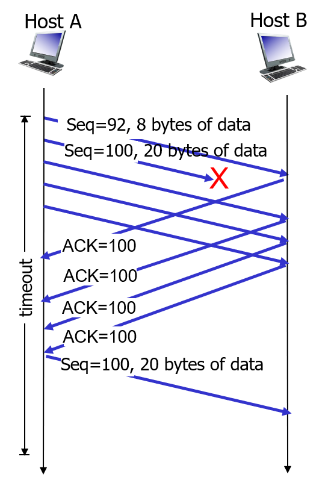

* 发送端

	客户端或服务端发送文件时，每次从文件中读取一定量的数据，并使用自定义的Packet类封装数据包，其中包含了当前数据包的序号（Sequence Number)和数据（Data)，然后发送数据包，将数据包存入缓存队列中，并更新下一个数据包的序号（Next Sequence Number）。若此时缓存队列只有1个数据包，说明计时器没有开启，则新建一个线程用于接收ACK，设置当前序号为Send Base，并且在线程中开启定时器。

	当收到接收端传来的ACK数据包时，判断ACK序号与当前SendBase的关系。若ACK序号大于当前SendBase，则说明SendBase到ACK序号之间的数据包都被成功接收，将这些数据包从缓存队列中移走。若ACK序号等于当前SendBase，说明出现了丢包，收到三个重复的ACK则重传序号为SendBase的数据包。若超时，则重传序号为SendBase的数据包。

	相关代码：sender.py。

* 接收端

	接收端会记录一个期望接收到的序号。若收到大于该序号的数据包（乱序数据包），则将其存入缓冲队列，同时发送ACK，ACK序号为还没收到的期望序号。若收到等于该序号的数据包，则ACK下一个尚未收到的数据包，同时将前面已经收到的乱序数据包按顺序写入到文件中。

	相关代码：receiver.py。


### 流控制

接收方在发送ACK时，会将自己接收缓冲区的剩余空间大小放入数据包的rwnd字段中。发送端接收到ACK时，会得到接收方的接收窗口的大小，从而调整自己的发送窗口大小，使发往接收方的数据不会溢出。

相关代码：receiver.py、sender.py

### 阻塞控制

阻塞控制分为三个阶段：慢启动、阻塞避免和快速恢复。具体的逻辑如下：

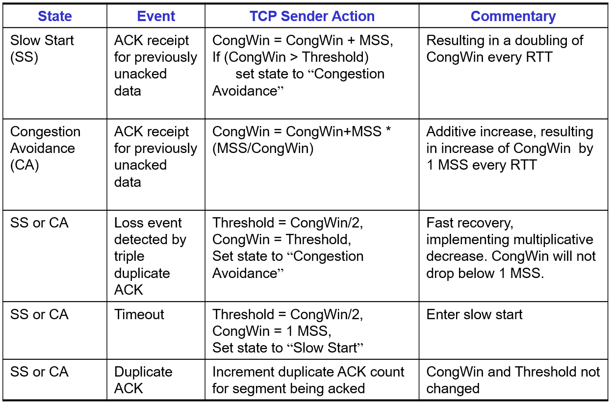

该应用实现的方法是，在发送方接收ACK时，判断当前阻塞控制的阶段，并根据丢包、超时等情况，调整阻塞窗口的大小。

相关代码：sender.py

### 多用户

客户端请求传输文件时，服务端会寻找可用的端口。若存在可用端口，则将端口反馈回客户端，并使用端口绑定新的Socket，然后创建新的线程负责该用户的文件传输任务。若没有可用端口，则反馈相应的信息。

相关代码：server.py

## 应用测试

### 启动客户端和服务端

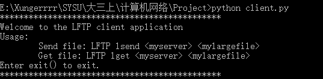


### 单个客户端上传


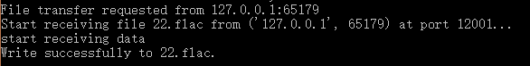

### 单个客户端下载

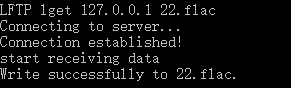
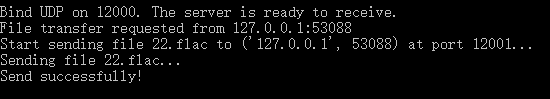

### 多个客户端同时上传

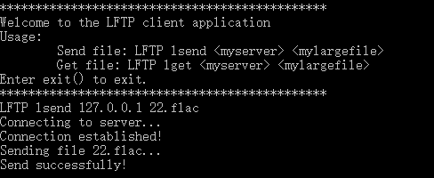
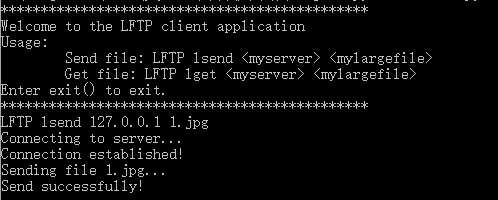
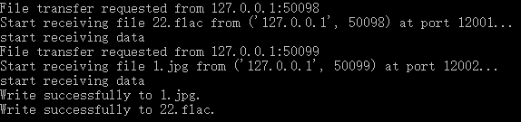

### 多个客户端同时下载

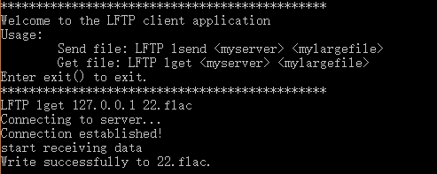

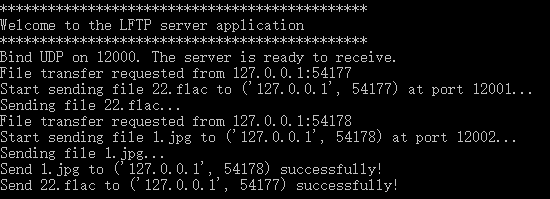

### 多个客户端同时上传或下载

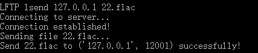
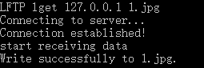
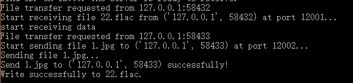

### 可靠传输、流控制、阻塞控制
当发生丢包、超时、重传等事件时，程序会显示debug信息。


